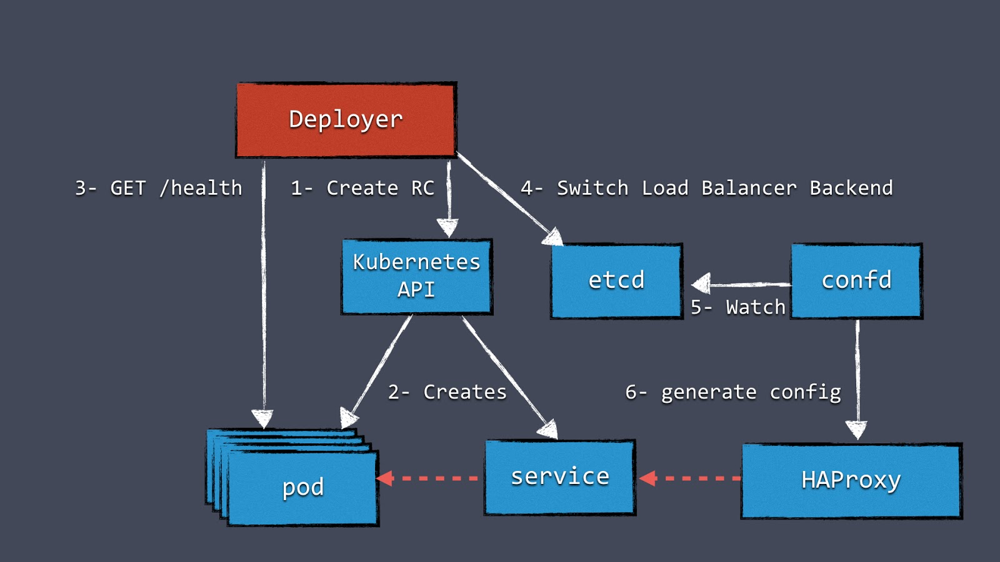

# Create Cluster Kubernetes - On Premises
**Can be deployed on KVM, VirtualBox, VMware or OpenStack**

### Supported Linux Distributions
    
   * Ubuntu 16
   * CentOS/RHEL 7
    
### Installation

To deploy the cluster you can use:

   * Ansible 2.6.1
   * Python version 2.7.12 
    
### Supported Components

   * etcd v3.3.8
   * docker 18.06.0-ce 
   * keepalived v1.3.5
   * kubernetes v1.11.1
   * weave v2.4.0
    
### Step 1 - Configure file vars/main.yml

```bash
# certificate cfssl -SSL
expiry: 24000h
corp: corporation
cfssl: /etc/cfssl

# ips (do not change)
ips-etcd: "{{groups['etcd']|join(',')}}"
ips-master: "{{groups['master']|join(',')}}"
ips-worker: "{{groups['worker']|join(',')}}"

# docker
storagedocker: /mvs
docker-version:

# kubernetes
k8sversionUbuntu: 1.11.1-00
k8sversionRedhat: 1.11.1-0*
podSubnet: 10.0.0.0/16
# NOTE: create TOKEN - run command
# python -c 'import random; print "%0x.%0x" % (random.SystemRandom().getrandbits(3*8), random.SystemRandom().getrandbits(
  #8*8))'
admission_token: 3e6035.191009b3012b14db

# etcd
etcdversion: v3.3.8
etcd: /etc/etcd
etcdstorage: /var/lib/etcd-cluster

# NOTE: Configure keepalived
interfacename: enp0s3
# Default
priority: 51
keeppass: p7S5gkT719R
state: MASTER
# IP VIP
virtualip: 192.168.56.200
```

- Set the environment variables

### Step 2 - Inventory 

- open file hosts 

Example:
```bash
[etcd]
192.168.56.111
192.168.56.112
192.168.56.113

[master]
192.168.56.111
192.168.56.112
192.168.56.113

[worker]
192.168.56.114
192.168.56.115

[all:vars]
ansible_ssh_user=administrator
ansible_ssh_private_key_file=~/kubernetes.pem
```

### Step 3 - Executing playbook Ansible

```bash
ANSIBLE_HOST_KEY_CHECKING=False ansible-playbook -i hosts ./tasks/main.yml --skip-tags destroyCluster
```